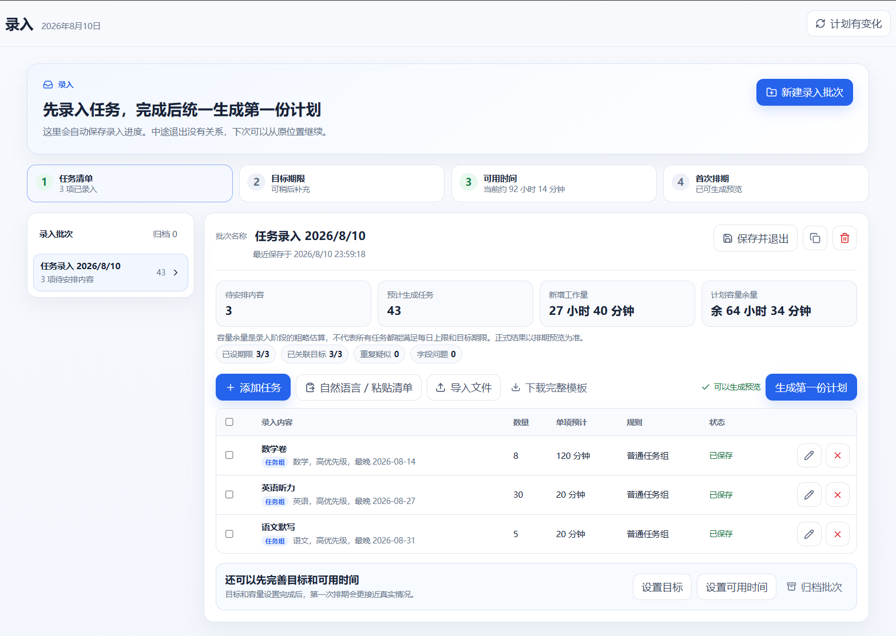
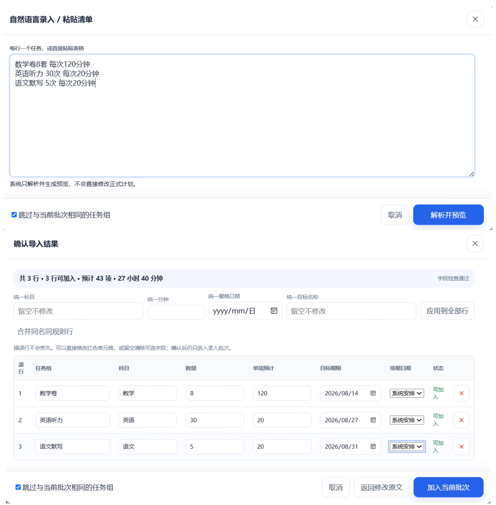
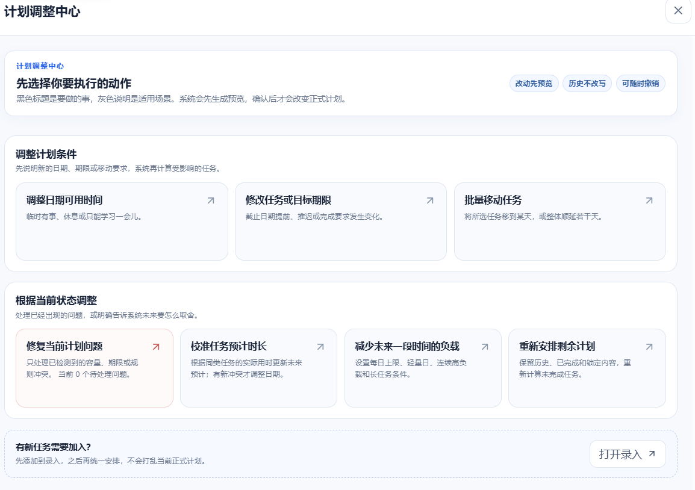

# Study Planner

> **An adaptive, execution-aware study planner for long-term goals. It combines batch task intake with minimal-disturbance schedule repair: collect first, schedule once, then keep repairing the plan as reality changes — with deadline/capacity constraints, manual/locked-task protection, multiple scheduling proposals, plan diff & impact analysis, explainable conflict resolution, preview-before-apply, and plan version restore.**

> **一个面向长期学习目标、由真实执行驱动的动态学习计划工具：任务多时可以先批量收集、统一排期；现实偏离原计划后，系统会尽量少改、保护已有安排，并在用户确认后再应用调整。**

**Live Demo / 在线体验：** [https://study-planner.yhwlwl.xyz](https://study-planner.yhwlwl.xyz)

[](LICENSE)


*系统不会直接覆盖计划：先生成候选方案，解释冲突、变化与长期影响，用户确认后才应用。*

Unlike traditional todo lists and static study schedules, Study Planner is designed for two difficult moments:

1. **building a large plan without repeatedly recalculating it after every new task;**
2. **keeping that plan usable after reality stops matching the original schedule.**

For large task sets, tasks can first be collected into resumable intake batches without touching the active schedule. Tasks can be added manually, written as one-line natural-language study items, pasted as a list, or imported from CSV/XLSX. Parsed content is reviewed and editable before it enters the intake batch. When the list is ready, selected or all tasks can be scheduled together.

After execution begins, unfinished work, partial completion, actual study time, availability changes, and deadline pressure can trigger **schedule repair** instead of full-plan regeneration.

The scheduler aims for **minimal disturbance**: preserve original dates and user intent whenever possible, then move only what is necessary.

它不只负责“第一次把计划排出来”，而是把完整过程做成：

**收集任务 → 统一排期 → 执行 → 复盘 → 偏差 → 计划修复 / 重排 → 继续执行**

---

## Key Features

- **Batch task intake / deferred scheduling** — collect many tasks across multiple sessions without recalculating the active plan after every addition; paste task lists or import CSV/XLSX, validate and edit first, then schedule all or selected tasks together;
- **Natural-language / free-form task capture** — write one task per line (for example, `数学卷 8 套，每套 90 分钟，8月20日前完成`); the local parser extracts common study-task fields such as subject, quantity, per-item duration, deadlines, desired/preferred/fixed dates, and recurring markers, then shows an editable preview before anything is added;
- **Guided first-plan onboarding & built-in tutorial** — blank workspaces guide users through task intake, goal deadlines, available time, and initial scheduling; the in-app guide also covers daily execution, review, replanning, metrics, and exports;
- **Execution-aware schedule repair / dynamic rescheduling** — recalculate future study tasks when actual progress differs from the original plan, including unfinished tasks, partial completion, missed study sessions, and actual time spent;
- **Minimal-disturbance rescheduling** — preserve original dates, locked tasks, manual intent, and protected dates whenever possible instead of regenerating the whole schedule;
- **Deadline & capacity-aware scheduling** — schedule around target dates, hard deadlines, daily study capacity, per-task limits, unavailable dates, reduced-capacity days, and special-capacity dates;
- **Constraint-aware scheduling** — balance multiple scheduling constraints instead of simply pushing overdue tasks to the next available day;
- **Manual intent / locked-task protection** — locked tasks, manually scheduled work, and protected dates are treated as user intent and are not silently rewritten;
- **Multiple Scheduling Proposals** — generate alternative repair strategies with different trade-offs instead of forcing a single automatic result;
- **Plan diff & impact analysis** — show task movements, date-load changes, goal impacts, rejected alternatives, and affected manual intent before applying a proposal;
- **Preview before apply** — proposed schedule changes are shown before they modify the active plan;
- **Explainable conflict resolution** — explain why constraints conflict, which tasks and values are involved, what the consequences are, and which resolution choices are available;
- **Plan versions / restore** — major adjustments create recoverable plan versions while preserving real execution records;
- **Real execution feedback** — record completed and partially completed tasks, actual duration, planned-vs-actual performance, and recent execution patterns;
- **Web / PWA** — responsive desktop and mobile web app with installable PWA support.

---

## Product Workflow

```text
Task capture (IntakeBatch)
  → manual add / natural language / paste / CSV / XLSX
  → validate, edit, save, resume later
  → schedule all or selected tasks together
  → SchedulingProposal preview
  → user approval
  → active plan

Active plan
  → real execution (planned vs. actual)
  → review / availability / deadline / workload changes
  → constraint-aware schedule repair
  → multiple SchedulingProposal candidates
  → plan diff + impact analysis + conflict resolution
  → user preview / approval
  → apply
  → PlanVersion
```

The intake layer and the active schedule are intentionally separated.

**Collecting tasks does not repeatedly rewrite the formal plan.** Scheduling happens when the user is ready.

Once a plan exists, replanning is treated as **schedule repair**, not full-plan regeneration.

> **Collect first. Schedule deliberately. Repair only what reality actually broke.**

---

## 典型场景 / Typical Scenario

你准备在 **60 天内完成一门课程**，或者需要一次规划几十项暑假作业。

### 1. 先把任务收齐，再统一排期

第一次建计划时，不需要每添加一个任务就重新计算整份日程。

Study Planner 提供独立的录入工作区。你可以：

- 分几次添加独立任务或任务组；
- 中途保存并在之后继续同一个录入批次；
- 直接用自然语言每行写一个任务，例如 `数学卷 8 套，每套 90 分钟，8月20日前完成`；
- 直接粘贴已有任务清单；
- 导入 CSV / XLSX；
- 在解析预览中检查和修改识别出的科目、数量、单项时长、期限等字段；
- 先检查任务数量、预计时长、期限和目标关联；
- 最后一次性安排全部任务，或者只安排选中的任务。

**录入阶段只负责收集、保存和校验，不会修改当前正式计划，也不会因为每增加一项任务就重新计算整个日程。**



如果不想逐项打开表单，也可以直接用自然语言把任务写成清单。解析只生成可编辑预览，不会直接修改正式计划。



任务收齐以后，再根据截止日期、每日容量、任务规则和目标期限生成第一份长期计划。


### 2. 真实执行开始偏离原计划

现实中可能出现：

- 今天原本计划学习 3 小时，实际只完成了 1.5 小时；
- 某个任务实际用了 4 小时，而原本只预计 2 小时；
- 下周突然有两天无法学习；
- 某些任务必须在月底前完成；
- 某些任务已经手动安排好，不希望系统移动；
- 还有一些任务已经锁定，不能为了“优化”被自动改写。

Study Planner 会记录完成、部分完成和实际用时，而不是只留下一个“完成 / 未完成”的勾选状态。


### 3. 复盘真实执行，而不是假设原估时永远正确

一天结束后，可以直接比较计划时间和实际时间，并逐项决定未完成任务接下来怎么处理。


系统还可以根据近期真实样本给出更合理的时长建议，但**只提供建议，不会静默覆盖原来的估时或移动计划**。

### 4. 计划变化时，先说清楚“现在发生了什么”

当计划不再合适时，不需要先理解一堆调度参数。

计划调整中心把常见动作直接分开，例如：

- 临时没时间或某几天只能学一会儿；
- 任务 / Goal 的期限提前或推迟；
- 批量移动一组任务；
- 只修复当前已经出现的容量、期限或规则问题；
- 根据真实执行校准预计时长；
- 减少未来一段时间的负载；
- 从指定日期重新安排剩余计划。

无论选择哪一种，系统仍然会先计算影响，再生成预览。



### 5. 重排不是简单把逾期任务全部往后推

系统会重新计算未来日期的任务负载，并展示调整前后的变化。


对于具体任务，可以继续查看它为什么被移动、为什么没有移动，或者为什么找不到满足当前约束的新日期。


### 6. 最后检查长期目标是否仍然可达

任务重排之后，系统会继续评估目标预计完成时间以及最晚期限风险，而不是只回答“明天学什么”。


所以一次重排最终回答的不只是：

> “下一项任务放到哪一天？”

而是：

> **“按照我现在真实的进度、未来可用时间和已有安排，我还能不能完成这个长期目标？”**

所有系统调整都会先生成候选方案并解释影响。你可以预览、逐项微调，确认后再应用；如果之后发现调整结果并不合适，还可以恢复之前保存的计划版本。

---

## 内置教程 / Built-in Guide

Study Planner 的功能比较多，因此空白用户不会被直接丢进一个复杂界面。

第一次建计划时，会按照：

**任务清单 → 目标期限 → 可用时间 → 首次排期**

逐步完成建档。

侧边栏中的 **使用教程** 继续覆盖：

- 第一次建计划；
- 每天如何执行、计时和复盘；
- 计划变化时应该使用哪一种调整动作；
- 原计划 / 已发生实际 / 执行负载 / 容量等指标；
- 月历、统计和导出入口。


---

## 这是什么

学习计划真正困难的地方其实有两个。

第一个发生在计划开始以前：

> **任务很多的时候，怎么把几十项内容快速收集起来，而不是每加一项就重新排一次？**

第二个发生在计划开始以后：

> **原计划和真实执行产生偏差以后怎么办？**

Study Planner 因此把“任务录入”和“正式计划”分成两个阶段。

任务多时，先进入独立录入批次。录入期间可以分次保存，也可以用自然语言逐行描述任务、粘贴清单或导入表格；解析结果会先进入可编辑预览，再加入批次。整个收集阶段不会持续触发完整调度。任务收齐以后，再统一生成第一份安排。

计划开始执行以后，任务可能没有完成、只完成了一部分、耗时比预计更长；某些日期可能突然无法学习，每天可投入的时间也可能变化。

这时系统不是简单地“重新生成一张新计划”，而是以现有计划为基线进行 **schedule repair / 计划修复**：根据剩余任务、目标期限、每日容量和已有安排重新计算后续计划，同时尽量保留原有日期和用户已经表达过的意图。

Study Planner 最终形成：

**任务收集 → 首次排期 → 实际执行 → 复盘 → 偏差识别 → 冲突处理 → 调整预览 → 继续执行**

的完整闭环。

但“能够自动重排”并不意味着“系统可以随便改”。

Study Planner 把用户已经表达的意图视为调度约束：能少改就不多改，锁定任务、手动安排和受保护日期不会被静默覆盖。需要重新规划时，系统会先生成可解释的候选方案，用户确认后才修改正式计划。

---

## 核心能力

- **批量录入与延迟排期**：新增任务可以先进入独立录入批次，在不影响正式计划的情况下分次收集、校验、粘贴或导入；任务收齐后再统一安排全部或所选内容；
- **自然语言任务录入**：支持每行一个自由描述的学习任务，本地解析常见的科目、数量、单项时长、截止 / 期望 / 偏好 / 固定日期等信息，并在加入批次前提供可编辑预览；
- **任务清单导入**：支持直接粘贴任务清单，以及 TXT / CSV / TSV / XLSX 文件导入、字段映射、错误检查和修改；
- **首次建档引导与内置教程**：空白计划按照任务清单 → 目标期限 → 可用时间 → 首次排期完成建档，并提供覆盖日常执行、复盘、计划变化、统计与导出的使用教程；
- **目标驱动的计划设计**：Goal 使用期望日期（软约束）与最晚日期（硬目标）表达，支持全部 / 百分比 / 数量完成条件；
- **任务与任务组**：任务组定义共享规则，包括科目、优先级、每日上限、活动类型与强度；单项任务可覆盖标题、时长、备注与锁定状态；
- **日期约束**：支持不可用、降低容量、特殊容量、受保护缓冲日、日期说明以及日期范围；
- **Today 执行入口**：支持完成、部分完成、实际用时记录与专注计时；
- **真实执行反馈**：计划不只记录“完成 / 未完成”，还可以记录部分完成与实际耗时，为后续调整提供真实执行数据；
- **复盘与自适应时长建议**：比较计划 / 实际、处理未完成任务，并根据近期真实样本给出时长建议；建议不会自动覆盖原估时；
- **执行偏差驱动的计划修复**：任务未完成、实际耗时变化、日期容量变化或目标变化后，可以基于现有计划重新计算后续安排；
- **最小扰动式重排**：优先保留原日期、手动安排、锁定任务和受保护日期，只在必要范围内移动任务；
- **约束感知调度**：重排同时考虑目标期限、每日容量、每日上限、任务规则、日期约束以及用户已有安排，而不是简单把逾期任务向后顺延；
- **明确的计划调整中心**：日期可用时间、期限、批量移动、当前冲突、预计时长、未来负载和剩余计划重排分别进入对应流程；
- **多方案调整**：针对同一次变化可以生成不同取舍的 Scheduling Proposal，而不是强制接受唯一的“最优解”；
- **Plan diff / 影响分析**：展示任务移动、日期负载变化、目标影响、被拒绝的替代安排以及手动意图影响；
- **计划调整预览**：变化事件 → 候选方案 → 方案内逐项微调 → 用户确认 → 正式应用；
- **冲突可解释与决策**：区分绝对阻断、用户保护、可一次性例外、目标或结构冲突，并说明涉及任务、数值、原因、后果以及可选解决方式；
- **手动意图保护**：锁定任务、手动安排、受保护日期不会被系统静默改写；
- **计划版本与恢复**：重大变化自动保存本地 PlanVersion，恢复计划时保留已经发生的真实执行记录；
- **本地数据与同步边界**：游客与账号数据空间隔离，云端只同步可移植状态；
- **桌面 + 手机 + PWA**：响应式布局，支持移动端使用，并可作为 PWA 添加到主屏幕。

---

## 设计原则

Study Planner 的调度系统并不是为了在数学意义上“不惜一切代价地优化计划”，而是在：

> **用户意图 + 现实约束 + 长期目标**

之内寻找更合适的后续计划。

同时，大量任务的“收集”和“排期”也不应该被强行绑定：先把输入收齐，再进行一次有意义的计算，比每新增一项就反复重排更符合真实建档过程。

- **Low-friction capture** — 逐项表单、自然语言、粘贴清单和表格导入都进入同一录入层，先解析与校验，再决定何时排期；
- **Collect before schedule** — 大量任务可以先收集、校验和保存，准备好以后再统一排期；
- **User intent first** — 用户明确表达的操作和安排优先；
- **Minimal disturbance / Minimal-scope changes** — 能少改就不多改，优先保留原日期与已有结构；
- **Execution-aware planning** — 计划需要随着真实执行变化，而不是假设用户永远严格按照原计划行动；
- **Constraint-aware schedule repair** — 在已有计划上修复偏差，同时考虑期限、容量、任务规则和已有安排，而不是机械顺延或整表重生成；
- **Manual intent protection** — 锁定任务、手动排期和保护日期被视为明确的用户意图；
- **Preview before apply** — 系统修改正式计划之前，先生成可解释、可预览的候选方案；
- **Explainable conflict resolution** — 不只告诉用户“排不下”，还要说明是什么约束导致、涉及哪些任务、有什么后果，以及可以如何处理；
- **Recoverable planning** — 重大调整产生 PlanVersion，可以恢复，并尽量不破坏已经发生的真实执行记录。

---

## 架构概览

```text
任务录入 (IntakeBatch)
  → 独立任务 / 任务组
  → 自然语言 / 粘贴清单 / TXT / CSV / TSV / XLSX
  → 保存、恢复、校验与编辑
  → 选择全部或部分任务统一排期
  ↓
PlanChangeEvent
  → 调整策略协调（精确校验 / 推荐预览 / 可选优化 / 探索式优化）
  → 统一调度核心（容量、每日上限、目标期限、手动意图、日期保护）
  → schedule repair / 多方案生成（Web Worker 计算，可取消）
  → SchedulingProposal
      ├─ task movements / plan diff
      ├─ date load changes
      ├─ goal impacts
      ├─ manual intent impacts
      ├─ rejected alternatives
      └─ explainable conflicts / resolutions
  → 方案预览、逐项微调、冲突决策
  → 用户确认
  → 应用并记录一次性例外
  → 创建 PlanVersion
```

录入层和正式计划相互分离：任务收集阶段不会因为每新增一项就反复修改正式日程。

底层仍只有一套调度引擎。

「尽量少改 / 均衡执行 / 目标优先 / 更多休息」四种策略是同一调度引擎在不同目标下的评分取舍，而不是四套互相独立的重排系统。

---

## 项目状态

- 当前版本：`v0.9.0`
- 状态：`Active development`（持续迭代）
- License：GNU Affero General Public License v3.0 or later
- 数据：本地优先（IndexedDB），可选 Supabase 账号同步；游客空间独立
- 在线体验：[https://study-planner.yhwlwl.xyz](https://study-planner.yhwlwl.xyz)

---

## 技术栈

React 18、TypeScript（strict）、Vite、PWA（vite-plugin-pwa）、Supabase、IndexedDB（idb）、Recharts、date-fns、Zod、read-excel-file、lucide-react。

---

## 本地运行

```bash
npm install
cp .env.example .env
npm run dev
```

`.env` 示例：

```env
VITE_SUPABASE_URL=https://your-project.supabase.co
VITE_SUPABASE_ANON_KEY=sb_publishable_xxx
```

浏览器端不得使用 `service_role` 或 `sb_secret_...`；访问日志所需的高权限密钥只能放在服务端环境变量中，且不能使用 `VITE_` 前缀。

访问计数接口为 `/api/visit-log`，健康状态与累计页浏览量均可直接查看；README 徽章使用同一数据源。

---

## 验证

```bash
npm run test:quality
npm run test:intake
npm run test:scenarios
npm run test:adjustment
npm run test:ui
npm run test:efficiency
npm run validate:v08
npm run build
```

验证性质说明：

- `test:quality`：TypeScript 静态检查 + Vitest 测试 + planner performance gate；
- `test:intake`：批量录入、保存、恢复与统一排期相关运行级验证；
- `test:scenarios`：目标、复盘、冲突、局部操作与用户效率场景；
- `test:adjustment`：计划调整与预览流程运行级验证；
- `test:ui`：桌面与手机界面布局审计；
- `test:efficiency`：用户效率与统计口径验证；
- `validate:v08`：历史架构、行为与非功能验证；
- `build`：真实 Vite 生产构建。

项目同时包含 Vitest、fast-check、axe-core、移动端专项验证和计划性能门禁。运行结果会随设备与负载变化，因此 README 不把本机基准值当作通用性能承诺。

---

## 数据与隐私

- 游客计划保存在独立本地命名空间；
- 登录账号使用独立数据空间，不会静默上传已修改的游客计划；
- 首次登录可选择导入游客计划、使用账号演示计划或从空白开始；
- 云端同步只上传当前可移植状态，不上传重型本地计划版本、旧重排快照或冲突备份；
- 完整计划版本历史仅保存在当前设备，设置页会明确提示。

---

## 文档索引

- [更新日志](docs/CHANGELOG.md)
- [迁移指南](docs/MIGRATION_GUIDE.md)
- [部署说明](docs/DEPLOYMENT.md)

## License

Study Planner is released under the [GNU Affero General Public License v3.0 or later](LICENSE).
