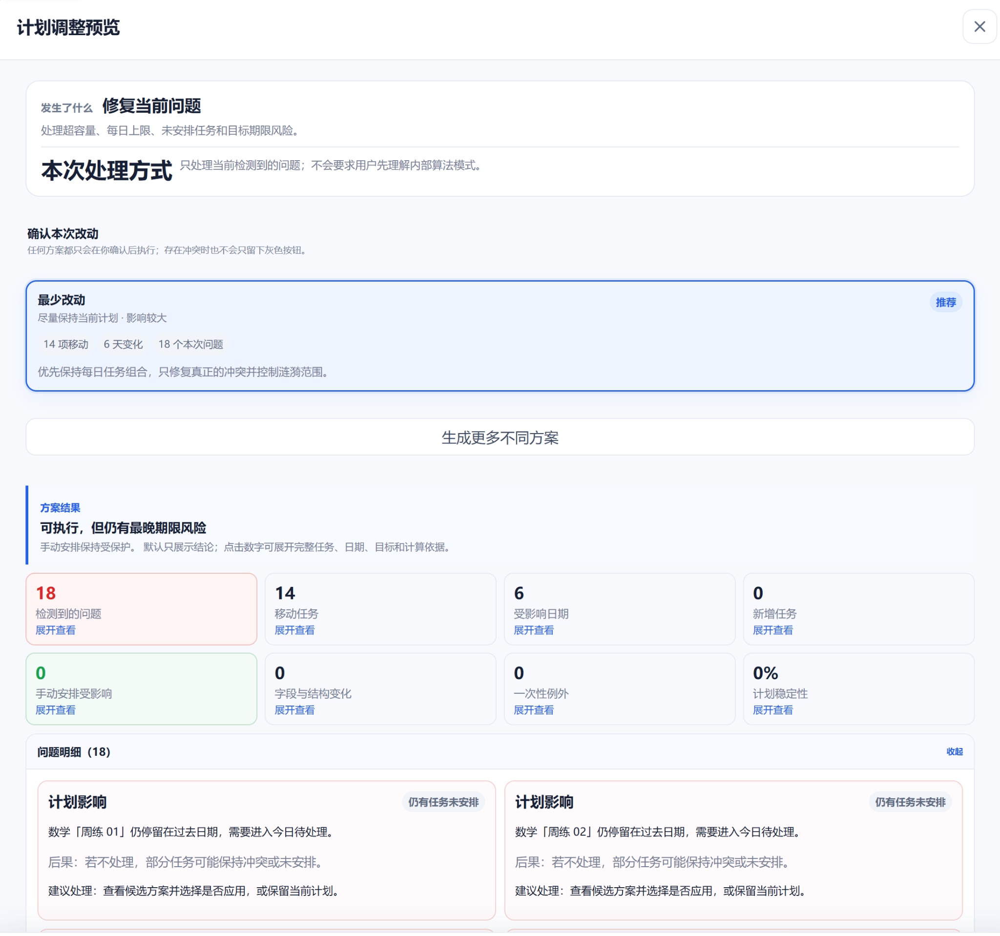
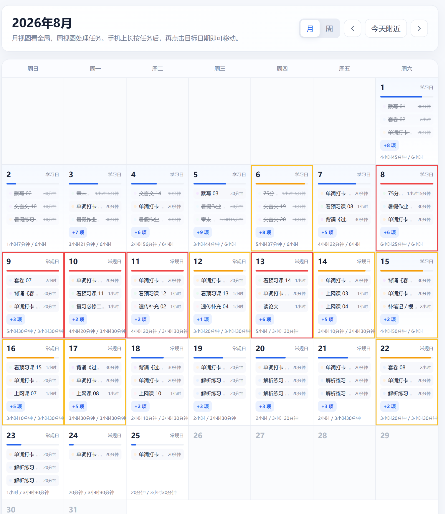
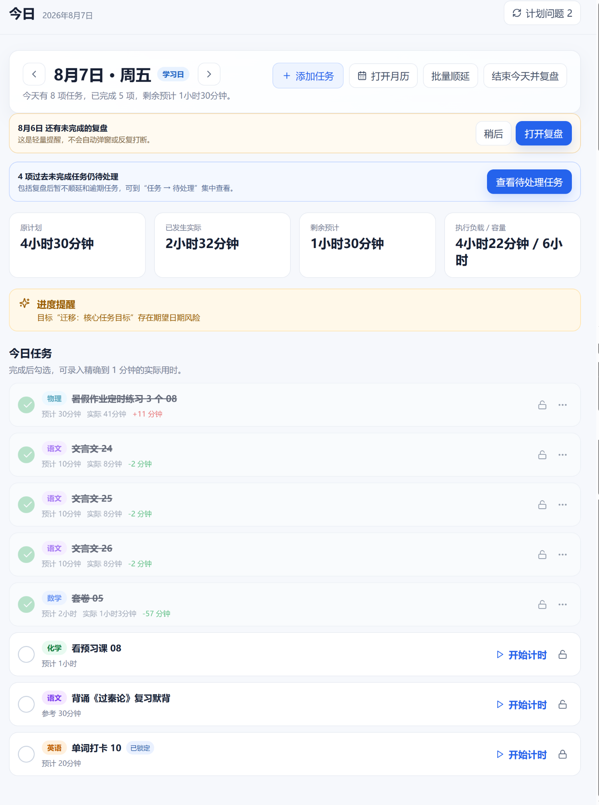
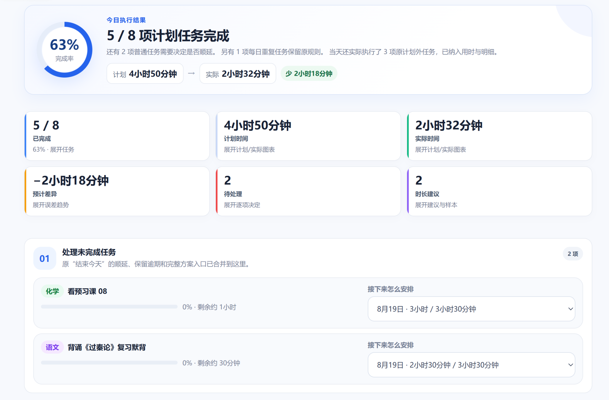
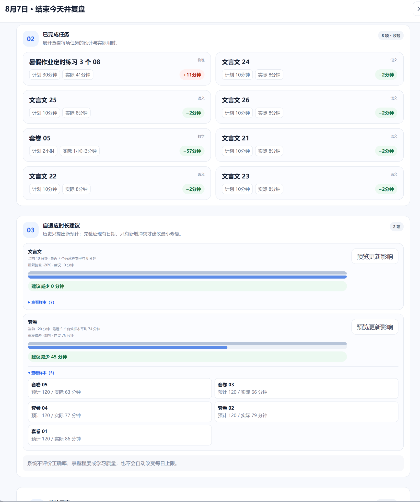
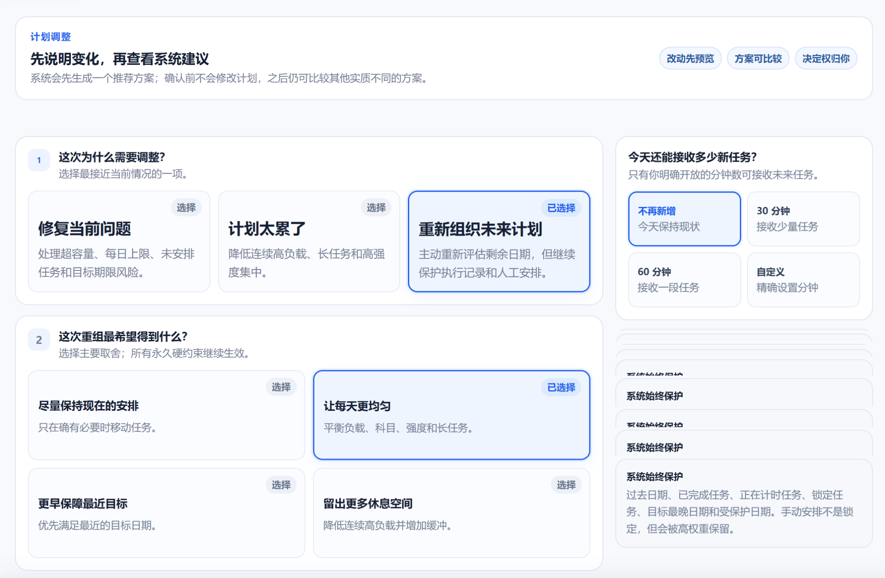

# Study Planner

> **An adaptive, execution-aware study planner for long-term goals — with constraint-aware rescheduling, deadline and capacity-aware scheduling, manual intent protection, explainable conflicts, preview-before-apply, and recoverable plans.**

> **一个会根据真实学习进度持续重排、但不会擅自改动你已有安排的长期学习计划工具。**

**Live Demo / 在线体验：** [https://study-planner.yhwlwl.xyz](https://study-planner.yhwlwl.xyz)

*系统不会直接覆盖计划：先生成候选方案，解释冲突与影响，用户确认后才应用。*

Unlike traditional todo lists and static study schedules, Study Planner is built for what happens **after reality stops matching the original plan**.

When tasks are unfinished, actual study time differs from estimates, available time changes, or deadlines become harder to meet, Study Planner can **recalculate and reschedule future tasks** while respecting deadlines, daily capacity, task limits, locked tasks, manual arrangements, and protected dates.

Changes are **explained and previewed before they are applied**. Scheduling conflicts show their causes, affected tasks, and consequences. Major plan changes are versioned and can later be restored.

它不只负责“把计划排出来”，而是围绕长期目标建立：

**计划 → 执行 → 复盘 → 偏差 → 重排 → 继续执行**

的完整闭环。

---

## Key Features

- **Execution-aware dynamic rescheduling** — recalculate future study tasks when actual progress differs from the original plan, including unfinished tasks, partial completion, missed study sessions, and actual time spent;
- **Deadline & capacity-aware scheduling** — schedule around target dates, hard deadlines, daily study capacity, per-task limits, unavailable dates, reduced-capacity days, and special-capacity dates;
- **Constraint-aware scheduling** — balance multiple scheduling constraints instead of simply pushing overdue tasks to the next available day;
- **Manual intent / locked-task protection** — locked tasks, manually scheduled work, and protected dates are treated as user intent and are not silently rewritten;
- **Multiple rescheduling proposals** — generate alternative adjustment strategies with different trade-offs instead of forcing a single automatic result;
- **Preview before apply** — proposed schedule changes are shown before they modify the active plan;
- **Explainable scheduling conflicts** — explain why a schedule cannot satisfy all constraints, which tasks are involved, what values conflict, and what consequences different decisions may have;
- **Recoverable planning** — major adjustments create local plan versions that can later be restored without discarding real execution records;
- **Real execution feedback** — record completed and partially completed tasks, actual duration, planned-vs-actual performance, and recent execution patterns;
- **Web / PWA** — responsive desktop and mobile web app with installable PWA support.

---

## 典型场景 / Typical Scenario

你计划在 **60 天内完成一门课程**，已经根据截止日期和每天可学习时间排好了任务。

### 1. 先有一个真正可执行的长期计划

计划不是简单的任务列表，而是分布在未来日期上的学习安排，并同时受到每日容量、任务规则和目标期限约束。

### 2. 真实执行开始偏离原计划

现实中可能出现：

- 今天原本计划学习 3 小时，实际只完成了 1.5 小时；
- 某个任务实际用了 4 小时，而原本只预计 2 小时；
- 下周突然有两天无法学习；
- 某些任务必须在月底前完成；
- 某些任务已经手动安排好，不希望系统移动；
- 还有一些任务已经锁定，不能为了“优化”被自动改写。

Study Planner 会记录完成、部分完成和实际用时，而不是只留下一个“完成 / 未完成”的勾选状态。

### 3. 复盘真实执行，而不是假设原估时永远正确

一天结束后，可以直接比较计划时间和实际时间，并逐项决定未完成任务接下来怎么处理。

系统还可以根据近期真实样本给出更合理的时长建议，但**只提供建议，不会静默覆盖原来的估时或移动计划**。

### 4. 需要调整时，先选择“为什么调”和“希望怎么调”

传统 Todo List 或静态 Planner 通常只能告诉你：

> **任务逾期了。**

剩下几十天怎么重新安排，仍然需要自己计算。

Study Planner 会重新评估：

**剩余任务 + 实际完成情况 + 截止日期 + 每日可用时间 + 每日上限 + 任务规则 + 手动/锁定任务 + 日期约束**

并允许用户选择这次调整更重视什么，例如尽量少改、让负载更均衡、优先保障近期目标或留出更多缓冲空间。

### 5. 重排不是简单把逾期任务全部往后推

系统会重新计算未来日期的任务负载，并展示调整前后的变化。

对于具体任务，可以继续查看它为什么被移动、为什么没有移动，或者为什么找不到满足当前约束的新日期。

### 6. 最后检查长期目标是否仍然可达

任务重排之后，系统会继续评估目标预计完成时间以及最晚期限风险，而不是只回答“明天学什么”。

所以一次重排最终回答的不只是：

> “下一项任务放到哪一天？”

而是：

> **“按照我现在真实的进度、未来可用时间和已有安排，我还能不能完成这个长期目标？”**

所有系统调整都会先生成候选方案并解释影响。你可以预览、逐项微调，确认后再应用；如果之后发现调整结果并不合适，还可以恢复之前保存的计划版本。

---

## 这是什么

学习计划真正困难的往往不是第一次把任务排出来，而是：

> **原计划和真实执行开始产生偏差以后怎么办？**

实际学习中，任务可能没有完成、只完成了一部分、耗时比预计更长；某些日期可能突然无法学习，每天可投入的时间也可能变化，原本宽裕的目标会因此逐渐变得紧张。

Study Planner 把：

**计划生成 → 实际执行 → 复盘 → 偏差识别 → 冲突处理 → 调整预览 → 继续执行**

做成一个完整闭环。

当真实执行与原计划发生偏差时，系统可以根据剩余任务、目标期限、每日容量以及已有安排重新计算后续计划。

但“能够自动重排”并不意味着“系统可以随便改”。

Study Planner 把用户已经表达的意图视为调度约束：能少改就不多改，锁定任务、手动安排和受保护日期不会被静默覆盖。需要重新规划时，系统会先生成可解释的候选方案，用户确认后才修改正式计划。

---

## 核心能力

- **目标驱动的计划设计**：Goal 使用期望日期（软约束）与最晚日期（硬目标）表达，支持全部 / 百分比 / 数量完成条件；
- **任务与任务组**：任务组定义共享规则，包括科目、优先级、每日上限、活动类型与强度；单项任务可覆盖标题、时长、备注与锁定状态；
- **日期约束**：支持不可用、降低容量、特殊容量、受保护缓冲日、日期说明以及日期范围；
- **Today 执行入口**：支持完成、部分完成、实际用时记录与专注计时；
- **真实执行反馈**：计划不只记录“完成 / 未完成”，还可以记录部分完成与实际耗时，为后续调整提供真实执行数据；
- **复盘与自适应时长建议**：比较计划 / 实际、处理未完成任务，并根据近期真实样本给出时长建议；建议不会自动覆盖原估时；
- **动态计划重排**：任务未完成、实际耗时变化、日期容量变化或目标变化后，可以重新计算后续计划；
- **约束感知调度**：重排同时考虑目标期限、每日容量、每日上限、任务规则、日期约束以及用户已有安排，而不是简单把逾期任务向后顺延；
- **多方案调整**：针对同一次变化可以生成不同取舍的候选方案，而不是强制接受唯一的“最优解”；
- **计划调整预览**：变化事件 → 候选方案 → 方案内逐项微调 → 用户确认 → 正式应用；
- **冲突可解释**：区分绝对阻断、用户保护、可一次性例外、目标或结构冲突，并说明涉及任务、数值、原因与后果；
- **手动意图保护**：锁定任务、手动安排、受保护日期不会被系统静默改写；
- **计划版本与恢复**：重大变化自动保存本地版本，恢复计划时保留真实执行记录；
- **本地数据与同步边界**：游客与账号数据空间隔离，云端只同步可移植状态；
- **桌面 + 手机 + PWA**：响应式布局，支持移动端使用，并可作为 PWA 添加到主屏幕。

---

## 设计原则

Study Planner 的调度系统并不是为了在数学意义上“不惜一切代价地优化计划”，而是在：

> **用户意图 + 现实约束 + 长期目标**

之内寻找更合适的后续计划。

例如，用户只是删除一个任务时，系统的第一方案应该只完成删除，而不应该因为发现了“更优排法”，就未经请求重新安排大量其他任务。

- **User intent first** — 用户明确表达的操作和安排优先；
- **Minimal-scope changes** — 能少改就不多改，系统优化不会擅自扩大修改范围；
- **Execution-aware planning** — 计划需要随着真实执行变化，而不是假设用户永远严格按照原计划行动；
- **Constraint-aware rescheduling** — 重排同时考虑期限、容量、任务规则和已有安排，而不是机械顺延；
- **Manual intent protection** — 锁定任务、手动排期和保护日期被视为明确的用户意图；
- **Preview before apply** — 系统修改正式计划之前，先生成可解释、可预览的候选方案；
- **Explainable conflicts** — 不只告诉用户“排不下”，还要说明是什么约束导致、涉及哪些任务以及可能的解决方式；
- **Recoverable planning** — 重大调整产生计划版本，可以恢复，并尽量不破坏已经发生的真实执行记录。

---

## 项目状态

- 当前版本：`v0.8.15`
- 状态：`Active development`（持续迭代）
- 数据：本地优先（IndexedDB），可选 Supabase 账号同步；游客空间独立
- 在线体验：[https://study-planner.yhwlwl.xyz](https://study-planner.yhwlwl.xyz)

## 文档索引

- [更新日志](docs/CHANGELOG.md)
- [迁移指南](docs/MIGRATION_GUIDE.md)
- [部署说明](docs/DEPLOYMENT.md)
